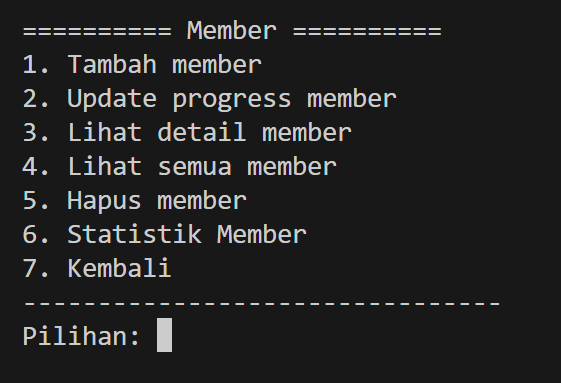
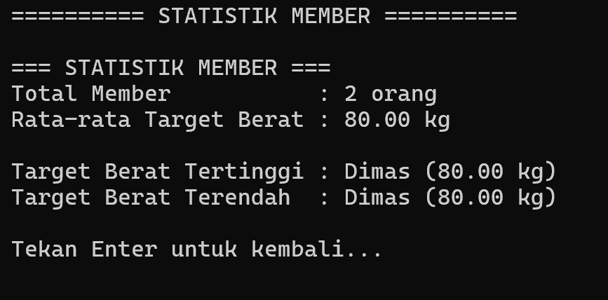
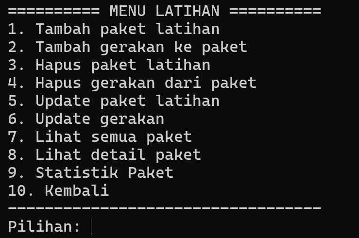
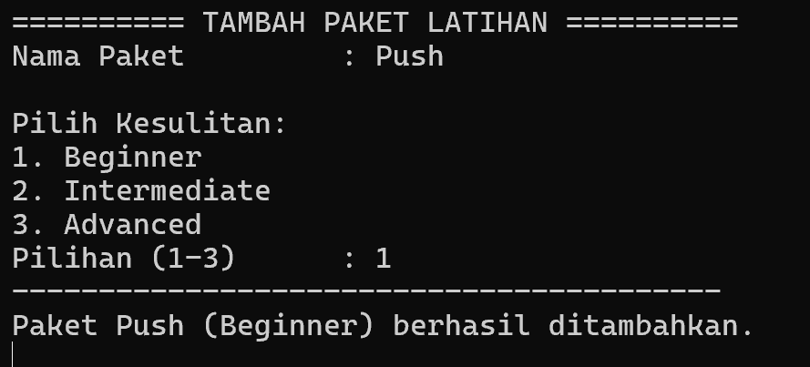
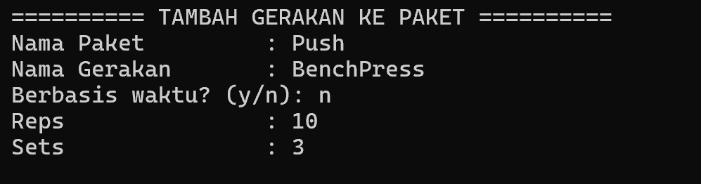
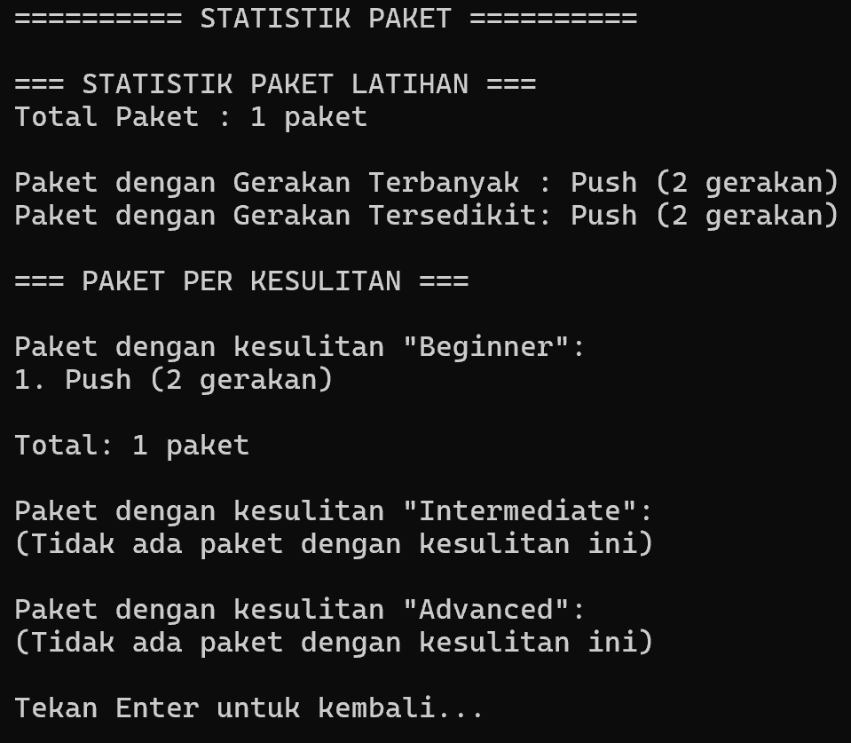
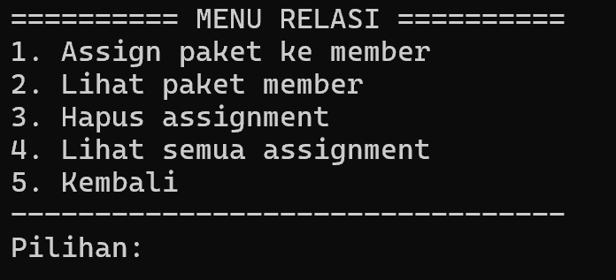
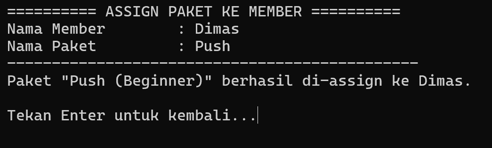

# LAPORAN TUGAS BESAR STRUKTUR DATA
## Sistem Manajemen Gym & Fitness Tracker

---

## 📋 IDENTITAS KELOMPOK

### Anggota Kelompok
1. **[Dimas Ramadhani]** - NIM: [103112400065]
2. **[Abisar Fathir]** - NIM: [103112400068]
3. **[Lutfi Shidqi Mardian]** - NIM: [103112400077]

---

## 🎯 JUDUL SISTEM

**"Gym & Fitness Tracker System - Sistem Manajemen Keanggotaan dan Paket Latihan Berbasis BST dan Multi Linked List"**

---

## 📖 DESKRIPSI SISTEM

### A. Overview Sistem

Gym & Fitness Tracker System adalah aplikasi manajemen gym yang dibangun menggunakan bahasa pemrograman C++ dengan implementasi struktur data **Binary Search Tree (BST)** dan **Multi Linked List (MLL)**. Sistem ini dirancang untuk memudahkan pengelolaan data member, paket latihan, dan relasi antara member dengan paket latihan yang mereka ikuti.

### B. Fitur Utama Sistem

#### 1️⃣ **Manajemen Member (Binary Search Tree)**
- Tambah member baru
- Update progress berat badan bulanan (array 12 bulan)
- Lihat detail member
- Lihat semua member (dengan berbagai traversal: inorder, preorder, postorder, level order)
- Hapus member
- **Statistik Member**: total member, rata-rata target berat, member dengan berat tertinggi/terendah

#### 2️⃣ **Manajemen Paket Latihan (Multi Linked List)**
- Tambah paket latihan dengan tingkat kesulitan (Beginner/Intermediate/Advanced)
- Tambah gerakan ke dalam paket (time-based atau reps-based)
- Update paket dan gerakan
- Hapus paket dan gerakan
- Lihat semua paket dan detail paket
- **Statistik Paket**: total paket, paket dengan gerakan terbanyak/tersedikit, filter by kesulitan

#### 3️⃣ **Manajemen Relasi Member-Paket**
- Assign paket ke member (dengan smart search)
- Lihat paket yang dimiliki member
- Hapus assignment
- Lihat semua assignment

---

## 🔬 IMPLEMENTASI TOPIK PERKULIAHAN

### 1. Binary Search Tree (BST)

#### ✅ Implementasi pada: **Manajemen Member**

**Struktur Data:**
```cpp
struct member {
    infoMember info_member;
    adrMember left;
    adrMember right;
};

struct infoMember {
    string nama_member;        // Key untuk BST
    float target_berat;
    float tinggi_badan;        // Tinggi badan member
    float progress_berat[12];  // Array of tipe dasar ✅
};
```

**Operasi BST yang Diimplementasikan:**

| Operasi | Fungsi | Kompleksitas |
|---------|--------|--------------|
| Insert | [insertNode()](gym.cpp#14-27) | O(log n) avg |
| Search | [findNode()](gym.cpp#69-81) | O(log n) avg |
| Delete | [deleteNode()](gym.cpp#252-287) | O(log n) avg |
| Traversal Inorder | [inorder()](gym.cpp#179-188) | O(n) |
| Traversal Preorder | [preorder()](gym.cpp#190-199) | O(n) |
| Traversal Postorder | [postorder()](gym.cpp#201-210) | O(n) |
| **Traversal Level Order** | [levelOrder()](gym.cpp#1074-1095) | O(n) |
| **Counting** | [countTotalMember()](gym.cpp#1097-1100) | O(n) |
| **Finding Min/Max** | [findMemberMaxWeight()](gym.cpp#1102-1117), [findMemberMinWeight()](gym.cpp#1119-1134) | O(n) |
| **Average** | [averageTargetWeight()](gym.cpp#1136-1148) | O(n) |

**Keunggulan BST:**
- Pencarian member lebih cepat (O(log n))
- Data terurut secara alfabetis (inorder traversal)
- Efisien untuk operasi CRUD

---

### 2. Multi Linked List (MLL) - Relasi 1-N

#### ✅ Implementasi pada: **Paket Latihan → Gerakan**

**Struktur Data:**
```cpp
// Parent (List of Paket)
struct paketLatihan {
    string nama_paket;
    string kesulitan;
    adrGerakan first;    // Pointer ke child list
    adrPaket next;       // Pointer ke paket berikutnya
};

// Child (List of Gerakan)
struct jenisGerakan {
    string nama_gerakan;      // Tipe dasar ✅
    bool isBerbasisWaktu;     // Tipe dasar ✅
    int frekuensi;            // Tipe dasar ✅
    int sets;                 // Tipe dasar ✅
    adrGerakan next;
};
```

**Operasi MLL yang Diimplementasikan:**

| Operasi | Fungsi | Keterangan |
|---------|--------|------------|
| Insert Parent | [insertPaket()](gym.cpp#403-411) | Tambah paket baru |
| Insert Child | [insertGerakan()](gym.cpp#413-424) | Tambah gerakan ke paket |
| Delete Parent | [deletePaket()](gym.cpp#475-511) | Hapus paket + semua gerakannya (cascade) |
| Delete Child | [deleteGerakan()](gym.cpp#514-544) | Hapus gerakan dari paket |
| **Search** | [findPaket()](gym.cpp#426-436), [findPaketByName()](gym.cpp#451-461) | Pencarian dengan smart search |
| **Counting** | [countTotalPaket()](gym.cpp#1151-1159), [countGerakanInPaket()](gym.cpp#1161-1169) | Hitung paket & gerakan |
| **Finding** | [findPaketMostExercises()](gym.cpp#1171-1188), [findPaketLeastExercises()](gym.cpp#1190-1207) | Paket terbanyak/tersedikit |
| **Filtering** | [viewPaketByKesulitan()](gym.cpp#1209-1228) | Group by kesulitan |

**Keunggulan MLL:**
- Relasi 1-N: 1 paket bisa punya banyak gerakan
- Flexible: jumlah gerakan per paket tidak terbatas
- Efficient deletion: cascade delete otomatis

---

### 3. Linked List - Relasi Member-Paket

#### ✅ Implementasi pada: **Assignment Member ke Paket**

**Struktur Data:**
```cpp
struct relasi {
    string nama_member;
    string nama_paket;
    string kesulitan_paket;
    adrRelasi next;
};
```

**Operasi yang Diimplementasikan:**
- Create relation
- Check duplicate relation
- Delete relation
- Display relations

---

### 4. Input Validation & Error Handling

#### ✅ Validasi yang Diimplementasikan:

| Input Type | Validation | Implementation |
|------------|------------|----------------|
| **Nama** | Not empty | `do-while` loop dengan `.empty()` check |
| **Target Berat** | 1-300 kg | Range validation |
| **Tinggi Badan** | 50-250 cm | Range validation |
| **Bulan** | 1-12 | Range validation |
| **Kesulitan** | Menu 1-3 | Menu-based selection (no typo) |
| **Y/N Input** | Must be y/n | Character validation |
| **Reps/Sets** | > 0 | Positive number check |
| **Duplicate** | Check before insert | [isRelasiExists()](relasi.cpp#25-37), [isGerakanExists()](gym.cpp#463-473) |

---

### 5. Advanced Features

#### ✅ Smart Search
Sistem otomatis mendeteksi apakah perlu menanyakan kesulitan paket:
- Jika hanya ada 1 paket dengan nama tersebut → langsung pilih
- Jika ada > 1 paket dengan nama sama → tanya kesulitan

#### ✅ Menu-Based Difficulty Selection
Menghindari typo dengan menggunakan menu numerik (1/2/3) instead of free text input.

#### ✅ Statistics & Analytics
- Total counting (member, paket, gerakan)
- Min/Max finding (berat tertinggi/terendah, paket terbanyak/tersedikit)
- Average calculation (rata-rata target berat)
- Grouping & filtering (paket by kesulitan)

---

## 📸 SCREENSHOT HASIL RUNNING

### 1. Main Menu

> Screenshot menampilkan menu utama dengan 4 pilihan: Info Member, Info Latihan, Relasi Member-Latihan, dan Keluar

### 2. Menu Member

> Menu manajemen member dengan 7 opsi termasuk statistik

### 3. Tambah Member

> Form input member dengan validasi

### 4. Statistik Member

> Menampilkan total member, rata-rata, max, dan min target berat

### 5. Traversal

> Hasil traversal BST

### 6. Menu Latihan

> Menu manajemen paket latihan dengan 10 opsi

### 7. Tambah Paket (Menu Kesulitan)

> Input paket dengan menu kesulitan (1-3)

### 8. Tambah Gerakan

> Form tambah gerakan dengan pilihan waktu/reps

### 9. Statistik Paket

> Statistik paket termasuk breakdown per kesulitan

### 10. Menu Relasi

> Menu untuk manage assignment member-paket

### 11. Assign Paket ke Member

> Form assignment dengan smart search dan validasi duplicate

---

## 💻 ISI SCRIPT LENGKAP

### A. Pseudocode

#### 1. Pseudocode BST - Insert Node
```
PROCEDURE insertNode(root, newNode)
    IF root == NULL THEN
        root = newNode
    ELSE IF newNode.nama < root.nama THEN
        root.left = insertNode(root.left, newNode)
    ELSE IF newNode.nama > root.nama THEN
        root.right = insertNode(root.right, newNode)
    END IF
END PROCEDURE
```

#### 2. Pseudocode BST - Delete Node
```
PROCEDURE deleteNode(root, nama)
    IF root == NULL THEN
        RETURN NULL
    END IF
    
    IF nama < root.nama THEN
        root.left = deleteNode(root.left, nama)
    ELSE IF nama > root.nama THEN
        root.right = deleteNode(root.right, nama)
    ELSE
        // Node found
        IF root.left == NULL THEN
            RETURN root.right
        ELSE IF root.right == NULL THEN
            RETURN root.left
        ELSE
            // Node has 2 children
            minNode = findMin(root.right)
            root.info = minNode.info
            root.right = deleteNode(root.right, minNode.nama)
        END IF
    END IF
    
    RETURN root
END PROCEDURE
```

#### 3. Pseudocode Level Order Traversal
```
PROCEDURE levelOrder(root)
    IF root == NULL THEN
        RETURN
    END IF
    
    queue[100]
    front = 0
    rear = 0
    
    queue[rear++] = root
    
    WHILE front < rear DO
        current = queue[front++]
        PRINT current.info
        
        IF current.left != NULL THEN
            queue[rear++] = current.left
        END IF
        IF current.right != NULL THEN
            queue[rear++] = current.right
        END IF
    END WHILE
END PROCEDURE
```

#### 4. Pseudocode MLL - Insert Gerakan
```
PROCEDURE insertGerakan(paket, newGerakan)
    IF paket.first == NULL THEN
        paket.first = newGerakan
    ELSE
        current = paket.first
        WHILE current.next != NULL DO
            current = current.next
        END WHILE
        current.next = newGerakan
    END IF
END PROCEDURE
```

#### 5. Pseudocode Statistics - Count Total
```
FUNCTION countTotalMember(root)
    IF root == NULL THEN
        RETURN 0
    END IF
    
    RETURN 1 + countTotalMember(root.left) + countTotalMember(root.right)
END FUNCTION
```

#### 6. Pseudocode Statistics - Find Max Weight
```
FUNCTION findMemberMaxWeight(root)
    IF root == NULL THEN
        RETURN NULL
    END IF
    
    maxNode = root
    leftMax = findMemberMaxWeight(root.left)
    rightMax = findMemberMaxWeight(root.right)
    
    IF leftMax != NULL AND leftMax.berat > maxNode.berat THEN
        maxNode = leftMax
    END IF
    IF rightMax != NULL AND rightMax.berat > maxNode.berat THEN
        maxNode = rightMax
    END IF
    
    RETURN maxNode
END FUNCTION
```

---

### B. Script C++ Lengkap

#### File: gym.h
```cpp
#ifndef GYM_H
#define GYM_H
#include <iostream>
#include <iomanip>
#include <limits>
using namespace std;


// Forward declarations
struct member;
struct paketLatihan;
struct jenisGerakan;
struct relasi;

typedef member* adrMember;
typedef paketLatihan* adrPaket;
typedef jenisGerakan* adrGerakan;
typedef relasi* adrRelasi;

// Struct untuk menyimpan info member
struct infoMember {
    string nama_member;
    float target_berat;
    int tinggi_badan;
    float progress_berat[12];  // Array 12 bulan
};

// Struct BST untuk member
struct member {
    infoMember info_member;
    adrMember left;
    adrMember right;
};

// Struct untuk paket latihan (parent MLL)
struct paketLatihan {
    string nama_paket;
    string kesulitan;
    adrGerakan first;
    adrPaket next;
};

// Struct untuk gerakan (child MLL)
struct jenisGerakan {
    string nama_gerakan;
    bool isBerbasisWaktu;
    int frekuensi;
    int sets;
    adrGerakan next;
};

// Struct untuk relasi member-paket
struct relasi {
    string nama_member;
    string nama_paket;
    string kesulitan_paket;
    adrRelasi next;
};

// Fungsi traversal
void inorder(adrMember root);
void preorder(adrMember root);
void postorder(adrMember root);
void levelOrder(adrMember root);

// Fungsi Pengolahan BST
int countTotalMember(adrMember root);
adrMember findMemberMaxWeight(adrMember root);
adrMember findMemberMinWeight(adrMember root);
float averageTargetWeight(adrMember root, int &count);

// Helper functions untuk deletion
adrMember findMin(adrMember root);
adrMember deleteNode(adrMember root, string nama);

// Fungsi Member
void lihatAllMember(adrMember root);
adrMember createNode(infoMember info);
void insertNode(adrMember &root, adrMember newNode);
adrMember findNode(adrMember root, string nama);
void updateProgMember(adrMember &root);
void detailMember(adrMember root);

// Menu Member
void menuMember(adrMember &root);
void lihatSemuaMember(adrMember root);
void hapusMember(adrMember &root);
void menuStatistikMember(adrMember root);

// Fungsi Multi Linked List - Paket Latihan
adrPaket createPaket(string nama, string kesulitan);
void insertPaket(adrPaket &head, adrPaket newPaket);
adrGerakan createGerakan(string nama, bool isBerbasisWaktu, int frekuensi, int sets);
void insertGerakan(adrPaket paket, adrGerakan newGerakan);
adrPaket findPaket(adrPaket head, string nama, string kesulitan);
int countPaketByName(adrPaket head, string nama);
adrPaket findPaketByName(adrPaket head, string nama);
bool isGerakanExists(adrPaket paket, string namaGerakan);
void deletePaket(adrPaket &head, string nama, string kesulitan);
void deleteGerakan(adrPaket paket, string namaGerakan);

// Menu Latihan
void menuLatihan(adrPaket &headPaket);
void tambahPaket(adrPaket &headPaket);
void tambahGerakan(adrPaket headPaket);
void hapusPaket(adrPaket &headPaket);
void hapusGerakan(adrPaket headPaket);
void updatePaket(adrPaket headPaket);
void updateGerakan(adrPaket headPaket);
void lihatSemuaPaket(adrPaket headPaket);
void detailPaket(adrPaket headPaket);

// Fungsi Pengolahan MLL
int countTotalPaket(adrPaket head);
int countGerakanInPaket(adrPaket paket);
adrPaket findPaketMostExercises(adrPaket head);
adrPaket findPaketLeastExercises(adrPaket head);
void viewPaketByKesulitan(adrPaket head, string kesulitan);
void menuStatistikPaket(adrPaket headPaket);

// Fungsi Relasi Member-Paket
adrRelasi createRelasi(string namaMember, string namaPaket, string kesulitanPaket);
void insertRelasi(adrRelasi &head, adrRelasi newRelasi);
bool isRelasiExists(adrRelasi head, string namaMember, string namaPaket, string kesulitan);
void deleteRelasi(adrRelasi &head, string namaMember, string namaPaket, string kesulitan);

// Menu Relasi
void menuRelasi(adrRelasi &headRelasi, adrMember rootMember, adrPaket headPaket);
void assignPaketToMember(adrRelasi &headRelasi, adrMember rootMember, adrPaket headPaket);
void lihatPaketMember(adrRelasi headRelasi);
void hapusAssignment(adrRelasi &headRelasi);
void lihatAllAssignments(adrRelasi headRelasi);

#endif
```

*Catatan: File gym.cpp, relasi.cpp, dan main.cpp terlalu panjang untuk ditampilkan seluruhnya di sini. Kode lengkap tersedia di repository project.*

---

## 🎥 LINK VIDEO DEMO

### YouTube
🔗 **[Link Video Demo YouTube](https://youtu.be/J464Y-MsMTw)**


**Isi Video:**
1. 00:00 Intro & Penjelasan Judul (0:00)
2. 00:56 Penjelasan Konsep BST (Member) (0:56 - 2:29)
3. 02:29 Penjelasan Konsep MLL (Paket Latihan) (2:29 - 4:08)
4. 04:08 Demo Running Program (4:08 - 18:43)
5. 18:43 Pembagian tugas (18:43 - 21:05)
6. 21:05 Penutup (21:05)

---

## 👥 PEMBAGIAN TUGAS KELOMPOK

### Anggota 1: Dimas Ramadhani - 33.33%

#### Tanggung Jawab:
- **Binary Search Tree Implementation**
  - Implementasi struct [member](gym.h#24-28) dan [infoMember](gym.h#17-22)
  - Fungsi [createNode()](gym.cpp#3-12), [insertNode()](gym.cpp#14-27), [deleteNode()](gym.cpp#252-287)
  - Fungsi [findNode()](gym.cpp#69-81), [findMin()](gym.cpp#244-250)
  - Traversal: [inorder()](gym.cpp#179-188), [preorder()](gym.cpp#190-199), [postorder()](gym.cpp#201-210), [levelOrder()](gym.cpp#1074-1095)

- **Member Management**
  - Fungsi [tambahMember()](gym.cpp#29-67)
  - Fungsi [updateProgMember()](gym.cpp#83-130)
  - Fungsi [hapusMember()](gym.cpp#289-325)
  - Fungsi [detailMember()](gym.cpp#327-378)
  - Fungsi [lihatSemuaMember()](gym.cpp#212-242)
  - Menu [menuMember()](gym.cpp#132-177)

- **Input Validation (Part 1)**
  - Validasi nama member (not empty)
  - Validasi target berat (1-300 kg)
  - Validasi tinggi badan (50-250 cm)
  - Validasi bulan (1-12)

#### Deliverables:
✅ File: [gym.h](gym.h#17-28,#55-69,#71-84) (struct member & declarations BST)  
✅ File: [gym.cpp](gym.cpp#3-378,#1072-1258) (BST implementation & statistics)  
✅ Documentation: BST algorithm explanation  
✅ Testing: BST operations

---

### Anggota 2: Abisar Fathir - 33.33%

#### Tanggung Jawab:
- **Multi Linked List Implementation**
  - Implementasi struct [paketLatihan](gym.h#40-45) dan [jenisGerakan](gym.h#32-38)
  - Fungsi [createPaket()](gym.cpp#382-390), [insertPaket()](gym.cpp#403-411), [deletePaket()](gym.cpp#475-511)
  - Fungsi [createGerakan()](gym.cpp#392-401), [insertGerakan()](gym.cpp#413-424), [deleteGerakan()](gym.cpp#514-544)
  - Fungsi [findPaket()](gym.cpp#426-436), [findPaketByName()](gym.cpp#451-461), [countPaketByName()](gym.cpp#438-449)
  - Fungsi [isGerakanExists()](gym.cpp#463-473)

- **Paket & Gerakan Management**
  - Fungsi [tambahPaket()](gym.cpp#548-597)
  - Fungsi [tambahGerakan()](gym.cpp#599-701)
  - Fungsi [hapusPaket()](gym.cpp#703-725) (cascade delete)
  - Fungsi [hapusGerakan()](gym.cpp#727-772)
  - Fungsi [updatePaket()](gym.cpp#774-844), [updateGerakan()](gym.cpp#846-926)
  - Fungsi [lihatSemuaPaket()](gym.cpp#928-968), [detailPaket()](gym.cpp#970-1034)
  - Menu [menuLatihan()](gym.cpp#1036-1070)

- **Input Validation (Part 2)**
  - Menu kesulitan (1-3) di tambahPaket & updatePaket
  - Validasi Y/N untuk berbasis waktu
  - Validasi reps/sets (> 0)
  - Duplicate gerakan check

#### Deliverables:
✅ File: [gym.h](gym.h#32-45,#85-107) (struct paket & gerakan, declarations MLL)  
✅ File: [gym.cpp](gym.cpp#382-1070) (MLL implementation complete)  
✅ Documentation: MLL algorithm explanation  
✅ Testing: MLL operations

---

### Anggota 3: Lutfi Shidqi Mardian - 33.34%

#### Tanggung Jawab:
- **Relasi Member-Paket Implementation**
  - Implementasi struct [relasi](gym.h#48-53)
  - Fungsi [createRelasi()](relasi.cpp#5-13), [insertRelasi()](relasi.cpp#15-23), [deleteRelasi()](relasi.cpp#39-65)
  - Fungsi [isRelasiExists()](relasi.cpp#25-37)
  - Fungsi [assignPaketToMember()](relasi.cpp#69-150) (with smart search)
  - Fungsi [lihatPaketMember()](relasi.cpp#152-197), [hapusAssignment()](relasi.cpp#199-254)
  - Fungsi [lihatAllAssignments()](relasi.cpp#256-282)
  - Menu [menuRelasi()](relasi.cpp#284-308)

- **Statistics & Analytics**
  - BST: [countTotalMember()](gym.cpp#1097-1100), [findMemberMaxWeight()](gym.cpp#1102-1117), [findMemberMinWeight()](gym.cpp#1119-1134), [averageTargetWeight()](gym.cpp#1136-1148)
  - MLL: [countTotalPaket()](gym.cpp#1151-1159), [countGerakanInPaket()](gym.cpp#1161-1169), [findPaketMostExercises()](gym.cpp#1171-1188), [findPaketLeastExercises()](gym.cpp#1190-1207), [viewPaketByKesulitan()](gym.cpp#1209-1228)
  - Menu [menuStatistikMember()](gym.cpp#1230-1258), [menuStatistikPaket()](gym.cpp#1259-1288)

- **Main Program & Integration**
  - File [main.cpp](main.cpp#1-40)
  - Menu utama
  - Integration testing
  - Bug fixing & final polishing
  - Buffer clearing fix (`cin.ignore` with `numeric_limits`)

#### Deliverables:
✅ File: [relasi.cpp](relasi.cpp#1-308) (complete)  
✅ File: [main.cpp](main.cpp#1-40) (complete)  
✅ File: [gym.h](gym.h#48-53,#116-128) (relasi struct & declarations)  
✅ File: [gym.cpp](gym.cpp#1097-1288) (statistics functions)  
✅ Documentation: System integration & testing report  
✅ Video demo & presentation materials

---

## 📊 SUMMARY PEMBAGIAN TUGAS

| Aspek | Anggota 1 | Anggota 2 | Anggota 3 |
|-------|-----------|-----------|-----------|
| **Data Structure** | BST | MLL | Linked List (Relasi) |
| **Lines of Code** | ~400 lines | ~500 lines | ~400 lines |
| **Kompleksitas** | Medium-High | High | Medium |
| **Testing** | BST ops | MLL ops | Integration |
| **Documentation** | Algorithm | Implementation | Final report |
| **Presentasi** | BST & Member | MLL & Paket | Statistics & Demo |

---

## 📈 KESIMPULAN

### Pencapaian:
✅ Implementasi lengkap BST dan MLL sesuai requirement  
✅ CRUD operations untuk semua entitas  
✅ Advanced features (statistics, smart search, menu-based input)  
✅ Input validation yang robust  
✅ Error handling yang baik  
✅ User-friendly interface  
✅ Kode terstruktur dengan baik (modular: 3 files)  

### Lessons Learned:
1. **BST** sangat efisien untuk data yang perlu diakses secara terurut
2. **MLL** memberikan flexibility untuk relasi 1-N dengan cascade operations
3. **Input validation** crucial untuk data quality dan user experience
4. **Menu-based input** lebih baik dari free text untuk mencegah typo
5. **Smart search** meningkatkan UX dengan mengurangi input yang tidak perlu

### Pengembangan Masa Depan:
- Implementasi persistence (save/load data to file)
- GUI menggunakan Qt atau web-based interface
- Export data to CSV/Excel
- Laporan progress member (grafik trend berat badan)
- Reminder untuk workout schedule

---

## 🙏 PENUTUP

Terima kasih kepada:
- **Dosen Struktur Data** atas bimbingan dan pembelajaran yang berharga
- **Asisten Praktikum** atas support dan feedback selama pengembangan
- **Rekan-rekan kelompok** atas kolaborasi yang solid

---